# Repodex Project Creation Synopsis

Repodox is a developer collaboration tool with a fun nerdy twist.

------

Figure A. Repodex initial "napkin concept" flowchart

## Table of Contents

[TOC]

## Scope

> [!NOTE]
>
> *Why this project? What is the purpose?*

​	We decided to make Repodex to assist with online developer collaboration, as well as to help motivate developers by showing work that is being done in a fun manner. One core focus of the project was also the technologies involved. Our group members wanted to try out something new, while also making something cool which we can actually use in our day to day lives.

Figure B. Final Repodex Webservice System Context Diagram

Figure C. Final Repodex sequence diagram

## Algorithm

> [!NOTE]
>
> *Steps followed for completing the project*

When brainstorming ideas to create this project, this is the process that we followed to end up with our Repodex product:

```mermaid
flowchart TB
    subgraph A [Brainstorming]
        A1[Generate ideas for technologies to learn and use] --> A2[Identify problem areas we wish to solve]
        A2 --> A3[Assess technologies we are proficient with already]
    end

    subgraph B [Creation]
        A3 --> B1[Brainstorm project concept]
        B1 --> B2[Determine if skill can be taught by one of us]
        B2 --> B3[Verify divisibility among the group]
        B3 --> B4[Check if project scope is manageable and extensible]
        B4 --> B5[Finalize project concept]
        B5 --> B6[Develop the Repodex product]
    end

    subgraph C [Resultant Product Description]
        B6 --> C1[Describe expected outputs]
        C1 --> C2[Create tool with a novel concept]
        C2 --> C3[Learn new skills &#40;Programming languages or tools&#41;]
        C3 --> C4[Build a useful code repository]
        C4 --> C5[Enhance inspiration and collaboration]
    end

    subgraph D [Extensions]
        C5 --> D1[Add Dynamic Motivational Messages feature]
        C5 --> D2[Extend compatibility with more services]
        C5 --> D3[Integrate various themes]
        C5 --> D4[Implement sequence of Poke-evolutions for commits]
        C5 --> D5[Expand user configuration options]
        C5 --> D6[Launch webapp control panel]
        C5 --> D7[Develop HTML product page]
    end

    style A fill:#b8daff,stroke:#333,stroke-width:2px
    style B fill:#ffc107,stroke:#333,stroke-width:2px,stroke-dasharray: 5, 5
    style C fill:#dc3545,stroke:#fff,stroke-width:2px
    style D fill:#28a745,stroke:#fff,stroke-width:2px

```

Figure D. Project Inception Process

**Inputs**

- Ideas for technologies to learn and use
- Problem area's we wish to solve
- What technologies each of us are proficient with already

**Processing**

- What can we make together that solves one of the problems and satisfies the following:
  - Has a technology we all want to learn, and at least one of us can teach the others
  - Can be divided into parts among the group members
  - Has a project scope which is both manageable, and extensible
- 

**Expected Output**

- A tool with a novel concept that is useful to us
- New learned skills (Programming languages or tools: rustlang, git, aws, etc)
- A useful code repository for the tool that we can proudly show on our resume / portfolio.
- Something that inspires us to code, and assists with our collaboration

## Project Enhancements

- Motivational "message of the day" at bottom of Repodex notification could be set to dynamically pick a different message for each commit
- Compatibility with additional messaging services can be added (Slack, MSTeams, Telegram, Whatsapp)
- Other character types or themes for the alert messages (other game images, anime characters, Dungeons and dragons, etc)
- Add option to send Poke-evolutions in sequence for commits from the same user
- Additional configuration options for users
- A deployed webapp control panel for setting up repositories
- html product page

# Bash Scripts

See attached scripts submission alongside this document.

All scripts are also on the repository on [Github](https://github.com/ConnorBP/pokemon-git-tracker).

- install
  - install-git.sh
  - install-github-cli.sh
- setup
  - setup-discord-webhook.sh
  - setup-git.sh
  - setup-post-commit.sh
  - setup-symlink.sh
- build.sh
- colors.sh
- install.sh
- invoke.sh
- main.sh
- menu.sh
- setup.sh
- watch.sh
- watchdog.sh

# Outputs Received

See output examples provided alongside this document.